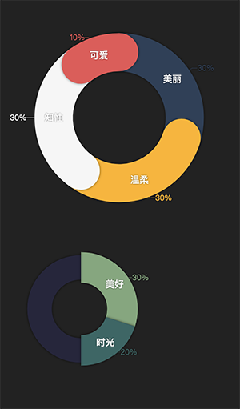

# canvas-circle
数据可视化--环形图  

####配置：  
```js
this.cfg = {
  el: '', // 容器id #box
  canvas: null, // 画布元素，程序内创建
  ctx: null,
  size: null, // 容器尺寸
  radius: 0.0, // 绘图半径 与size相关联 不用设置
  point: '', // 绘制原点坐标，因为初始化为二倍图，所以原点坐标初始化取size
  front: { // 数据环图
    thickness: 40, // 饼图厚度 如果有百分比标签[isDrowLabel]，厚度不能超过size的1/4
    lineCap: 'butt', // 'butt'直角 'round'圆角
    shadowX: 0.0, // 饼图阴影x轴位移
    shadowY: 0.0, // 饼图阴影y轴位移
    shadowBlur: 5 // 饼图阴影大小
  },
  bg: { // 背景
    fillColor: '#27253d', // 圆环颜色
    thickness: .8, // 背景与饼图厚度的占比1:100%，默认.8:80%
    shadowX: 0.0, // 背景阴影x轴位移
    shadowY: 0.0, // 背景阴影y轴位移
    shadowBlur: 5 // 背景阴影大小
  },
  label: {
    show: false, // 是否显示百分比，默认不显示
    fontFamily: 10 // 百分比标签 字号、字体
  },
  arrow: {
    show: false, // 是否显示数据标签，默认不显示
    fontFamily: 12, // 标示数据名标签 字号、字体
    fontColor: '#fff' // 标签数据名字体颜色
  },
  shadowColor: 'rgba(0,0,0,0.6)', // 所有阴影的颜色 [接受rgba、rgb格式]
  fontStyle: {
    textAlign: 'center', // 所有文案的居中方式默认为[居中]
    shadowColor: 'rgba(0,0,0,0.6)', // 字体阴影颜色 [接受rgba、rgb格式]
    shadowX: 0.0, // 字体阴影 x轴位移
    shadowY: 0.0, // 字体阴影 y轴位移
    shadowBlur: 5 // 字体阴影 大小
  },
  animation: {
    show: false, // 是否开启动画效果，默认是关闭
    duration: 70, // 动画时长， 每个数据的动画总时长相同， 速度根据数据值不同
    speed: [], //各数据的动画速度，目前只支持匀速
    locus: [] // 各数据的动画轨迹
  },
  data: [ // 占比总量100
    {
      value: 70, // 占比 百分比制
      name: '数据', // 数据名
      fillColor: '#0079FF' //饼图填充色 接受rgba、rgb格式
    }
    ...
  ]
};
```
####效果

